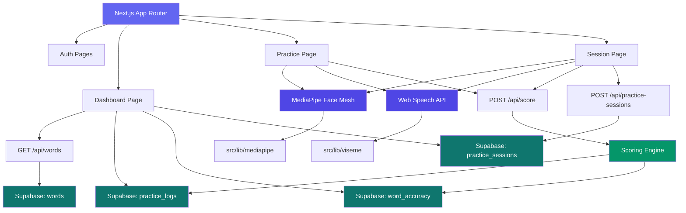

<!-- generated-by: gsd-doc-writer -->

# Architecture

## System Overview

ViSpeech is a browser-based Thai pronunciation training web app designed for hearing-impaired individuals. It captures the user's face via webcam and voice via microphone, then analyzes lip movement (visemes) alongside speech recognition to produce combined visual + audio scores with Thai-language feedback. The system follows a **client-heavy layered architecture**: a Next.js 16 App Router frontend orchestrates real-time browser subsystems (MediaPipe Face Mesh, Web Speech API) and communicates with Supabase for authentication, word lists, and score persistence. Scoring is performed server-side via a REST API route using a deterministic heuristic strategy.

## Component Diagram



## Data Flow

### Multi-Word Session (`/practice/session`)

1. On load, the page fetches all available words from `GET /api/words`, randomly picks an active set of 3 (`ACTIVE_SET_SIZE`), and presents the first word.
2. The practice loop repeats per-word camera + microphone + submission steps.
3. After each submission:
   - If the score passes the threshold (`PASS_THRESHOLD = 70`), the word is removed from the active set and replaced with a new unpracticed word from the pool.
   - Scores below threshold keep the word in the active set for retry.
4. The session ends when `MAX_ATTEMPTS (12)` is reached, the active set is empty (all words passed), or the user manually ends the session.
5. On completion: `POST /api/practice-sessions` saves a summary (`totalAttempts`, `passedCount`, `bestScore`) to the `practice_sessions` table, and the summary screen is displayed.

### Dashboard (`/dashboard`)

- Fetches word list via `GET /api/words`, user accuracy via `word_accuracy`, practice logs via `practice_logs`, and session history via `practice_sessions`.
- Displays three aggregate stat cards (words practiced, average score, total attempts), a word-by-word accuracy table with per-word "Practice" links, session history, and a practice log feed.

## Key Abstractions

| Abstraction                                | Role                                                                                          | File                                                       |
| ------------------------------------------ | --------------------------------------------------------------------------------------------- | ---------------------------------------------------------- |
| `FaceMeshInstance` (interface)             | Controls face tracking lifecycle: `start()/stop()/isActive()/onResult()`                      | `src/lib/mediapipe/index.ts`                               |
| `FaceMeshResult` (interface)               | Shape of tracking output: `landmarks`, `mouthOpen`, `hasFace`                                 | `src/lib/mediapipe/index.ts`                               |
| `initFaceMesh()`                           | Factory function — creates MediaPipe Face Mesh or demo fallback instance                      | `src/lib/mediapipe/index.ts`                               |
| `SpeechRecognizer` (interface)             | Controls speech recognition lifecycle: `start()/stop()/isAvailable()/onResult()/onError()`    | `src/lib/viseme/index.ts`                                  |
| `createSpeechRecognizer()`                 | Factory function — creates Web Speech API or demo fallback recognizer                         | `src/lib/viseme/index.ts`                                  |
| `ScoringStrategy` (interface)              | Strategy pattern for scoring: `score(params) => ScoreResult`                                  | `src/lib/scoring/index.ts`                                 |
| `DeterministicHeuristicStrategy` (class)   | Default scoring implementation combining audio string similarity + visual mouth-open distance | `src/lib/scoring/index.ts`                                 |
| `ScoreParams` / `ScoreResult` (interfaces) | Input and output shapes for the scoring engine                                                | `src/lib/scoring/index.ts`                                 |
| Supabase client helpers                    | `supabase` (browser client) and `createServerClient()` (server-side)                          | `src/lib/supabase/client.ts`, `src/lib/supabase/server.ts` |

## Directory Structure Rationale

```
src/
├── app/                    # Next.js App Router pages and API routes
│   ├── api/                # REST API endpoints (score, words, practice-sessions)
│   ├── auth/               # Login / sign-up page
│   ├── dashboard/          # Main dashboard with stats and practice history
│   ├── home/               # Landing page (redirects to /)
│   └── practice/           # Practice pages (session)
├── lib/                    # Core business logic and integrations
│   ├── mediapipe/          # MediaPipe Face Mesh wrapper with demo fallback
│   ├── viseme/             # Web Speech API wrapper with demo fallback
│   ├── scoring/            # Deterministic scoring engine
│   └── supabase/           # Supabase client and server helpers
├── types/                  # TypeScript type declarations (.d.ts)
└── middleware.ts           # Next.js middleware for route patterns
```

- **`src/app/`** follows Next.js App Router conventions — each directory represents a route segment. API routes are co-located under `src/app/api/` as route handlers (`route.ts`).
- **`src/lib/`** contains framework-agnostic business logic and third-party integrations, organized by subsystem. Each module exposes a clean interface and provides a demo fallback for environments where browser APIs or dependencies are unavailable.
- **`src/types/`** holds ambient type declarations for browser APIs not yet in TypeScript's standard lib (`SpeechRecognition`) and third-party modules (`@mediapipe/*`).
- **`supabase/migrations/`** contains versioned SQL migration files for the PostgreSQL schema, separate from application code.
- **`e2e/`** contains Playwright end-to-end tests; **`src/lib/viseme/__tests__/`** contains Vitest unit tests co-located with the module being tested.

## Scoring Strategy

The scoring engine (`src/lib/scoring/index.ts`) implements a strategy pattern via the `ScoringStrategy` interface, with one concrete implementation:

**`DeterministicHeuristicStrategy`**

- **Audio score** (60% weight): String similarity between the spoken transcript and the target word. Exact match → 95, partial overlap → 75, character-level overlap → up to 70, demo/unavailable input → 45 (base).
- **Visual score** (40% weight): Distance between measured `mouthOpen` (0–100) and an ideal value inferred from the word's viseme category. Wide words (e.g., "รัก", "สาม") → ideal 70, rounded words (e.g., "ดู", "สอง") → ideal 50, closed words (e.g., "แม่", "หนึ่ง") → ideal 30, default → 55.
- **Total**: `round(visualScore * 0.4 + audioScore * 0.6)`.
- **Feedback**: Thai-language hint selected by score thresholds (≥90 "ยอดเยี่ยม", low audio "ลองออกเสียงให้ชัดเจนขึ้น", low visual "ลองอ้าปากให้กว้างขึ้น", etc.).

> This is a heuristic/demo strategy — not clinically validated.

## Database Schema

Four tables managed via Supabase PostgreSQL with Row-Level Security (RLS):

| Table               | Purpose                            | Key Columns                                                                                                                           |
| ------------------- | ---------------------------------- | ------------------------------------------------------------------------------------------------------------------------------------- |
| `words`             | Thai practice word bank            | `id UUID PK`, `word TEXT`, `viseme_group TEXT`, `difficulty INTEGER`                                                                  |
| `practice_logs`     | Per-attempt scoring records        | `id UUID PK`, `user_id UUID FK(auth.users)`, `word_id UUID FK(words)`, `visual_score`, `audio_score`, `total_score`, `attempt_number` |
| `word_accuracy`     | Per-user per-word aggregated stats | Composite PK `(user_id, word_id)`, `best_score`, `average_score`, `total_attempts`, `last_practiced_at`                               |
| `practice_sessions` | Multi-word session summaries       | `id UUID PK`, `user_id UUID FK(auth.users)`, `total_attempts`, `passed_count`, `best_score`                                           |

All tables have RLS policies scoped to `auth.uid()` — users can only read/write their own data. The `words` table is readable by all authenticated users.

## Routing Summary

| Path                          | Type          | Purpose                                                               |
| ----------------------------- | ------------- | --------------------------------------------------------------------- |
| `/`                           | Page (client) | Session check → redirect to `/auth` or `/dashboard`                   |
| `/auth`                       | Page (client) | Login / sign-up via Supabase Auth                                     |
| `/dashboard`                  | Page (client) | Word list, accuracy stats, practice history, session history          |
| `/practice/session`           | Page (client) | Multi-word session with adaptive word rotation                        |
| `POST /api/score`             | API Route     | Compute score and persist to Supabase                                 |
| `GET /api/words`              | API Route     | Return word list (auth-protected, filterable by `group` and `search`) |
| `POST /api/practice-sessions` | API Route     | Save session summary to Supabase                                      |

## Fallback / Demo Mode

Both browser-native subsystems include automatic fallback when the API is unavailable:

- **MediaPipe fallback** (`src/lib/mediapipe`): If the `@mediapipe/face_mesh` import fails (e.g., CDN blocked), a fallback instance generates random `mouthOpen` values (20–79) on a 500ms interval, allowing the UI to function without a real webcam feed.
- **Speech fallback** (`src/lib/viseme`): If the Web Speech API is not available or returns a recoverable error (`network`, `not-allowed`, `audio-capture`, etc.), the system transparently switches to a fallback recognizer that returns `"demo-transcript"` with no real speech data. The scoring engine treats this as a 45% base audio score.

This design ensures the entire user flow from camera to mic to scoring is testable without specialized hardware, and the app gracefully degrades on older browsers.

## Technology Stack

| Layer              | Technology                                |
| ------------------ | ----------------------------------------- |
| Framework          | Next.js 16 (App Router)                   |
| Language           | TypeScript 5 (strict mode)                |
| Styling            | Tailwind CSS 4                            |
| Face Tracking      | MediaPipe Face Mesh (browser, CDN-loaded) |
| Speech Recognition | Web Speech API (`th-TH`)                  |
| Auth & Database    | Supabase (PostgreSQL, RLS, Auth)          |
| Font               | IBM Plex Sans Thai (variable)             |
| Testing            | Vitest (unit), Playwright (E2E)           |
